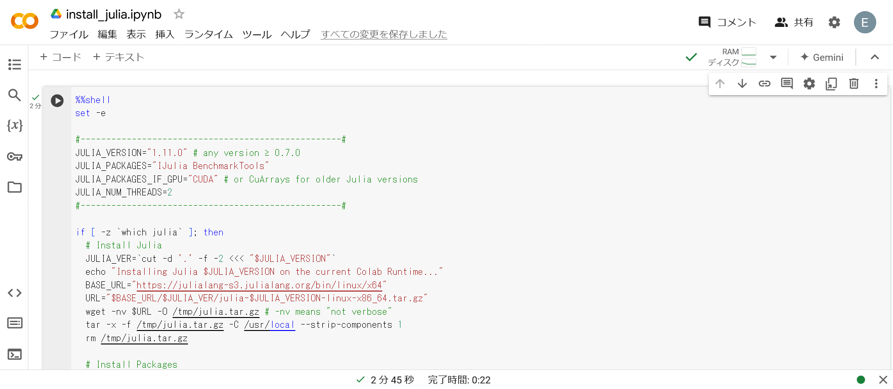
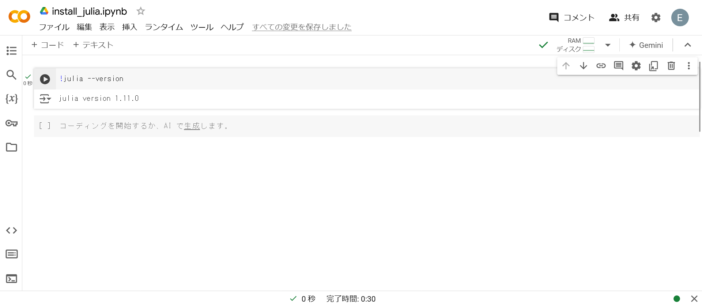
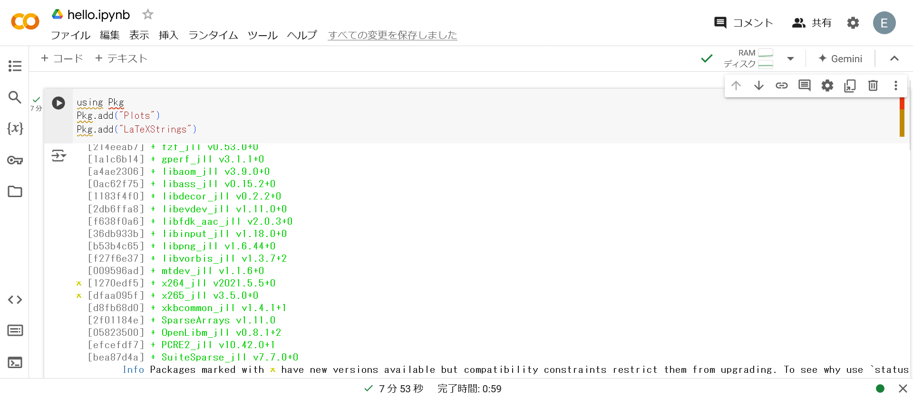
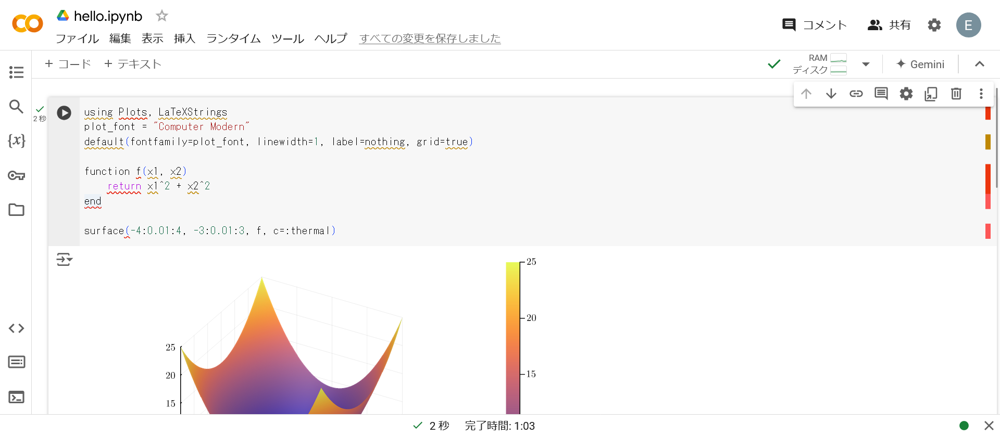
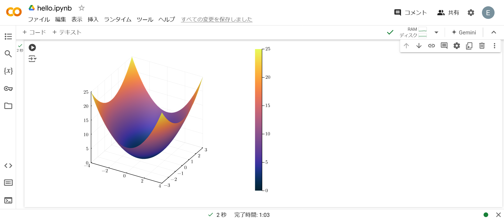

# Julia

Juliaは, (表面的には)インタプリタとして動作する言語です (内部的にはJITコンパイラで処理されている).

## インストール

JuliaはGoogle Colaboratoryの初期設定では使えないため, まずはインストールし, 有効化します.

1. 以下のコードをGoogle Colaboratory上で実行します. 

```sh
%%shell
set -e

#---------------------------------------------------#
JULIA_VERSION="1.11.0" # any version ≥ 0.7.0
JULIA_PACKAGES="IJulia BenchmarkTools"
JULIA_PACKAGES_IF_GPU="CUDA" # or CuArrays for older Julia versions
JULIA_NUM_THREADS=2
#---------------------------------------------------#

if [ -z `which julia` ]; then
  # Install Julia
  JULIA_VER=`cut -d '.' -f -2 <<< "$JULIA_VERSION"`
  echo "Installing Julia $JULIA_VERSION on the current Colab Runtime..."
  BASE_URL="https://julialang-s3.julialang.org/bin/linux/x64"
  URL="$BASE_URL/$JULIA_VER/julia-$JULIA_VERSION-linux-x86_64.tar.gz"
  wget -nv $URL -O /tmp/julia.tar.gz # -nv means "not verbose"
  tar -x -f /tmp/julia.tar.gz -C /usr/local --strip-components 1
  rm /tmp/julia.tar.gz

  # Install Packages
  nvidia-smi -L &> /dev/null && export GPU=1 || export GPU=0
  if [ $GPU -eq 1 ]; then
    JULIA_PACKAGES="$JULIA_PACKAGES $JULIA_PACKAGES_IF_GPU"
  fi
  for PKG in `echo $JULIA_PACKAGES`; do
    echo "Installing Julia package $PKG..."
    julia -e 'using Pkg; pkg"add '$PKG'; precompile;"' &> /dev/null
  done

  # Install kernel and rename it to "julia"
  echo "Installing IJulia kernel..."
  julia -e 'using IJulia; IJulia.installkernel("julia", env=Dict(
      "JULIA_NUM_THREADS"=>"'"$JULIA_NUM_THREADS"'"))'
  KERNEL_DIR=`julia -e "using IJulia; print(IJulia.kerneldir())"`
  KERNEL_NAME=`ls -d "$KERNEL_DIR"/julia*`
  mv -f $KERNEL_NAME "$KERNEL_DIR"/julia  

  echo ''
  echo "Successfully installed `julia -v`!"
  echo "Please reload this page (press Ctrl+R, ⌘+R, or the F5 key) then"
  echo "jump to the 'Checking the Installation' section."
fi
```



以下のような出力が得られればOKです.

```txt
Installing Julia 1.11.0 on the current Colab Runtime...
2024-10-09 15:19:40 URL:https://storage.googleapis.com/julialang2/bin/linux/x64/1.11/julia-1.11.0-linux-x86_64.tar.gz [254121552/254121552] -> "/tmp/julia.tar.gz" [1]
Installing Julia package IJulia...
Installing Julia package BenchmarkTools...
Installing IJulia kernel...
[ Info: Installing julia kernelspec in /root/.local/share/jupyter/kernels/julia-1.11

Successfully installed julia version 1.11.0!
Please reload this page (press Ctrl+R, ⌘+R, or the F5 key) then
jump to the 'Checking the Installation' section.
```

2. ノートブックを再読み込みします.
3. `julia --version`でインストール確認をします. 以下のように出力されればOKです.



```{tip}
シェルコマンドを実行する際には, `!`を使用します (複数行の場合は`%%shell`).
```

## Hello, World!

以下は, Juliaで標準出力をする例です.


### 解説

特にありません.

## グラフ描画

さすがに味気ないのでグラフ描画の例も示します.

まず, `Plots`と`LaTeXStrings`をインストールします. パッケージのインストールは以下のように行います.

```jl
using Pkg
Pkg.add("Plots")
Pkg.add("LaTeXStrings")
```



パッケージのインストールが完了したら, 実際に描画していきます.

ここでは,

$$
f(x_{1},x_{2})=x_{1}^{2}+x_{2}^{2},\quad \forall x_{1}\in[-4,4], \forall x_{2}\in[-3,3]
$$

を描画しています.




### 解説

```jl
using Plots, LaTeXStrings
plot_font = "Computer Modern"
default(fontfamily=plot_font, linewidth=1, label=nothing, grid=true)

function f(x1, x2)
    return x1^2 + x2^2
end

surface(-4:0.01:4, -3:0.01:3, f, c=:thermal)
```

1行目ではパッケージを読み込んでいます. 2-3行目はプロットフォントをComputer Modernに設定しています (LaTeX表記がしたいため). 5-7行目では描画する関数を定義しています. 9行目では定義した関数を定義域内で描画しています.
