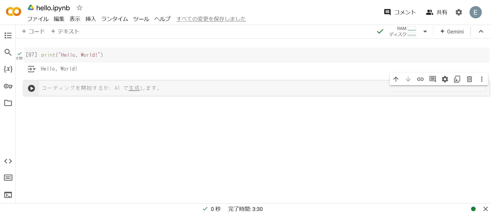
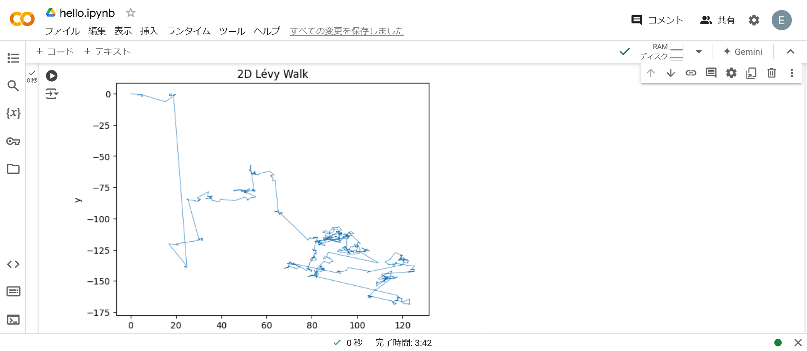

# Python

Pythonはインタプリタ言語です.

## Hello, World!

以下は, Pythonで標準出力をする例.



### 解説

特にありません.

## レヴィウォーク

味気ないため, レヴィウォークのシミュレーション例を以下に示します.



なお, コードは以下の通りです.

```py
import numpy as np
import matplotlib.pyplot as plt

def gamma(x):
    from scipy.special import gamma as gamma_func
    return gamma_func(x)

def random_normal():
    return np.random.normal()

def mantegna(beta):
    if beta < 0.005:
        beta = 0.005
    t = gamma(1 + beta) * np.sin(np.pi * beta / 2)
    t = t / (gamma((1 + beta) / 2) * beta * 2 ** ((beta - 1) / 2))
    sigma = t ** (1 / beta)
    u = random_normal() * sigma
    v = random_normal()
    return u / (np.abs(v) ** (1 / beta))

def levy_walk(steps, beta):
    x, y = np.zeros(steps), np.zeros(steps)
    for i in range(1, steps):
        theta = np.random.uniform(0, 2 * np.pi)
        r = mantegna(beta)
        x[i] = x[i-1] + r * np.cos(theta)
        y[i] = y[i-1] + r * np.sin(theta)
    return x, y

steps = 1000
beta = 1.5
x, y = levy_walk(steps, beta)

plt.plot(x, y, lw=0.5)
plt.title('2D Lévy Walk')
plt.xlabel('x')
plt.ylabel('y')
plt.show()
```

### 解説

過去にHTML+JSで作成したシミュレーションがあったので[こちら](https://rice8y.github.io/Itp-gc/levy.html)を参照してください.
