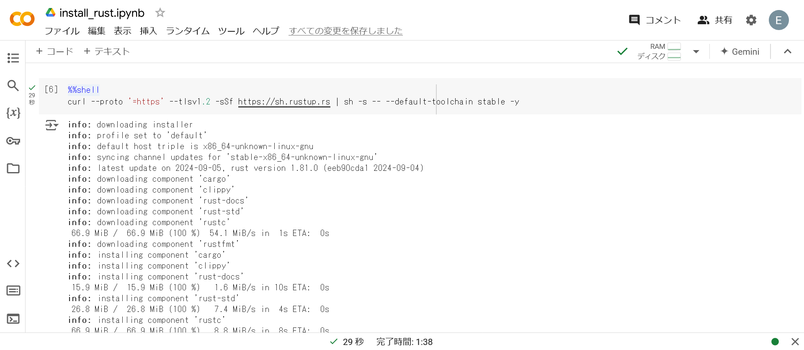
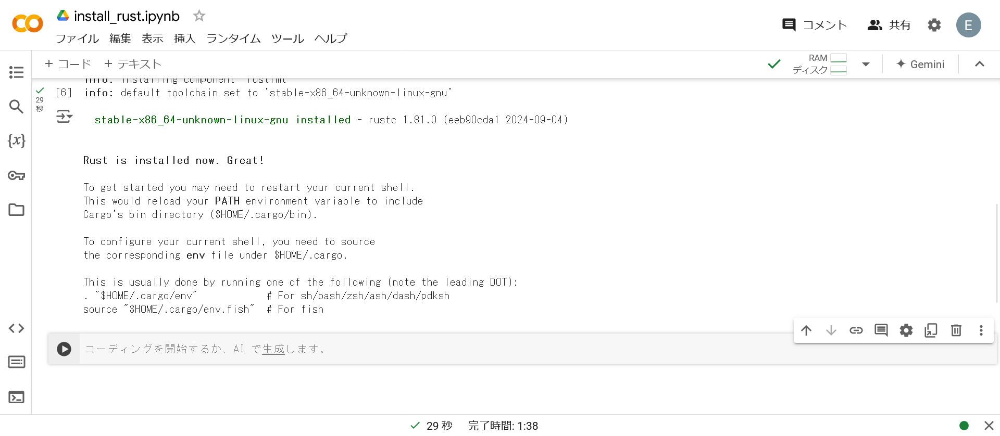
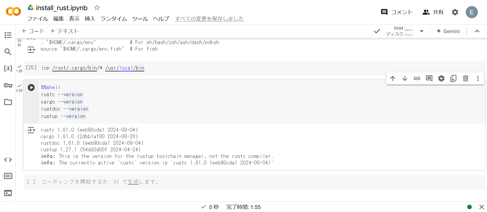
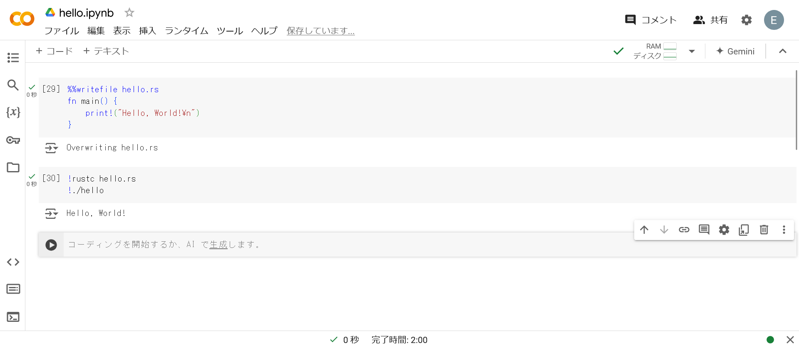

# Rust

Rustはコンパイラ言語のため, Google Colaboratory上で直接セルを実行することはできません. そのため, マジックコマンド`%%writefile`を使用して, セル内のコードをファイルとして保存し, そのファイルをコンパイルします.

## インストール

RustはGoogle Colaboratoryの初期設定では使えないため, まずはインストールします.

1. 以下のコードをGoogle Colaboratory上で実行します.

```bash
%%shell
curl --proto '=https' --tlsv1.2 -sSf https://sh.rustup.rs | sh -s -- --default-toolchain stable -y
```

> [!TIP]
> シェルコマンドを実行する際には, `!`を使用します (複数行の場合は`%%shell`).



以下のような出力が得られればOKです.



2. `!cp /root/.cargo/bin/* /usr/local/bin`でバイナリファイルをコピーします.

元々は, `!source $HOME/.cargo/env`で環境変数を設定するはずでしたが何故か上手くいきませんでした...

3. 以下のコードでインストール確認をします.

```bash
%%shell
rustc --version
cargo --version
rustdoc --version
rustup --version
```

以下のような出力が得られればOKです.



## Rustプログラムの実行手順

1. Rustファイル(`.rs`)を作成する.
2. Rustファイル(`.rs`)をコンパイルして実行ファイルを生成する.
3. 実行ファイルを実行する.

## Hello, World!

以下は, Rustで標準出力をする例です.



### 解説

#### 1つ目のセル

```rs
%%writefile hello.rs
fn main() {
    print!("Hello, World!\n")
}
```

ここでは, `%%writefile hello.rs`により, セル内のコード(マジックコマンド以下)を`hello.rs`として保存しています.

#### 2つ目のセル

```bash
!rustc hello.rs
!./hello
```

1行目では, `hello.rs`を`rustc`でコンパイルし, 実行ファイル`hello`を生成しています. 2行目では, 実行ファイル`hello`を実行しています.

---
<div style="display: flex; justify-content: space-between;">
  <a href="./julia.md">< Julia</a>
  &nbsp;&nbsp;
  <a href="./go.md">Go ></a>
</div>
