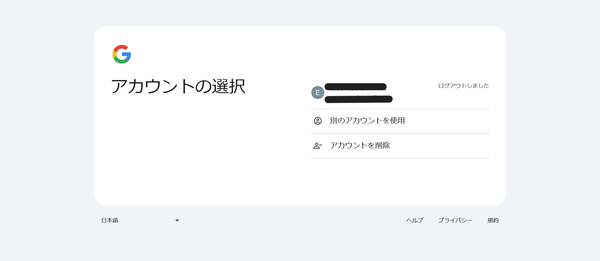
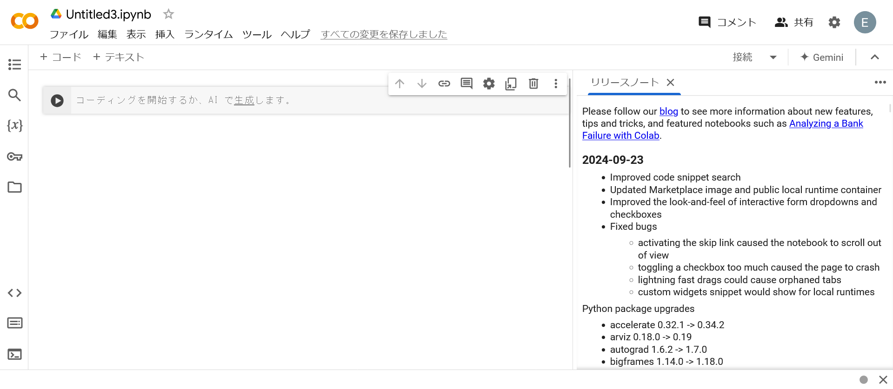
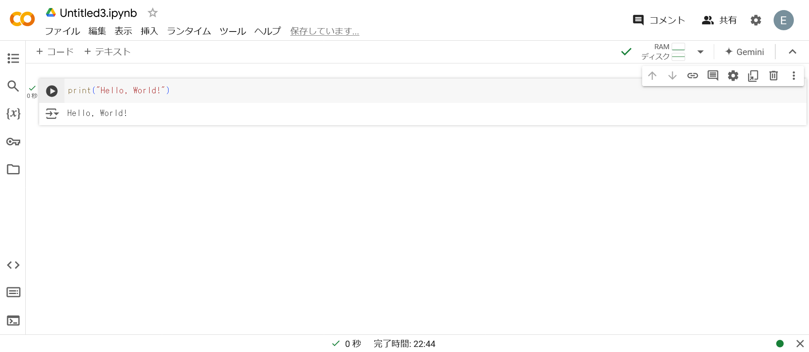
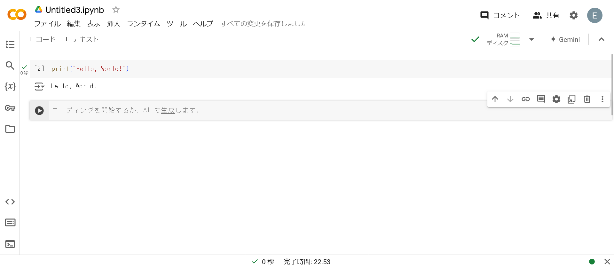
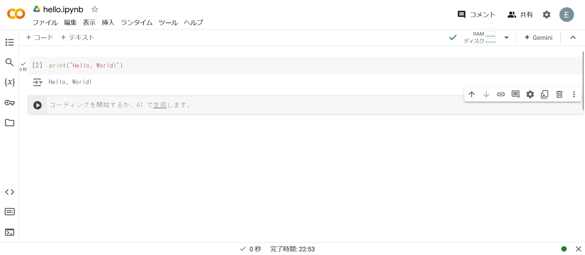

# 開発環境準備

従来であれば自身のコンピュータに開発環境を構築しなければなりませんが, オンライン開発環境の普及により, 環境構築の手間が省けるようになりました. ここでは, そのようなオンライン開発環境の中でもメジャーなGoogle Colaboratoryを使用してプログラミングに入門してみます.

## Google Colaboratory

1. [https://colab.research.google.com/](https://colab.research.google.com/) へアクセスします.


1. Googleアカウントでログインします.



以下のようになればOKです.


### 基本的な使い方

#### ノートブック (`.ipynb`) の新規作成

1. `ファイル > ドライブの新しいノートブック` を選択し, ノートブックを新規作成します.
 以下のようになればOKです.


#### コードの実行

1. コードセルにコードを記述します (以下は, Pythonで標準出力をする例).


1. 実行ボタンをクリックします.



```{tip}
`Shift+Enter`でも実行可能です. なお, `Shift+Enter`で実行する場合, 次のセルに移動します. この際に, 次のセルが存在しない場合 (現在の実行セルが最下行である場合), 新規セルが作成されます.
```

#### コードの追加

左上の`+コード`やコードセルの下部にカーソルを合わせた際に表示される`+コード`をクリックして追加します.



#### ファイル名の変更

左上のファイル名 (Google Driveのロゴの横) をクリックしてファイル名を変更します. 以下は, `Untitled3.ipynb`から`hello.ipynb`に変更している例です.


